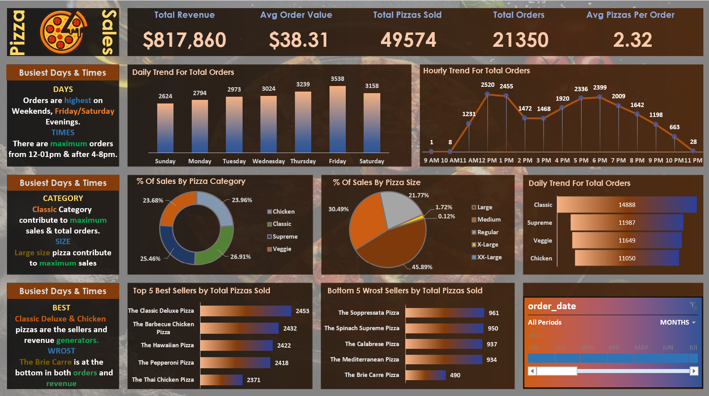

# 🍕 Pizza Sales Dashboard - Excel + SQL

This project showcases an interactive Excel dashboard connected to a SQL database to analyze pizza sales performance. The dashboard highlights key trends in revenue, order volume, pizza categories, and customer behavior.

## 📊 Key Insights

- Total Revenue: $817,860  
- Total Orders: 21,350  
- Average Order Value: $38.31  
- Average Pizzas per Order: 2.32  
- Top Selling Pizza: The Classic Deluxe Pizza  
- Lowest Selling Pizza: The Brie Carre Pizza

## 🔍 Dashboard Features

- Sales trends by day and hour
- Sales breakdown by pizza category and pizza size
- Top 5 and Bottom 5 pizzas by total pizzas sold
- KPI summary cards with slicers
- Dynamic filters for custom time-based analysis

## Tools Used

- SQL (for querying and cleaning raw sales data)  
- Microsoft Excel (for dashboard creation)  
- Pivot Tables, Slicers, Conditional Formatting, Charts

## Files Included

- PizzaSalesDashboard.xlsx – Main dashboard file  
- Dashboard screenshot  
- README.md – Project overview

## Preview

## Contact

For questions or collaboration:  
Bilal – [Your email or LinkedIn here]
